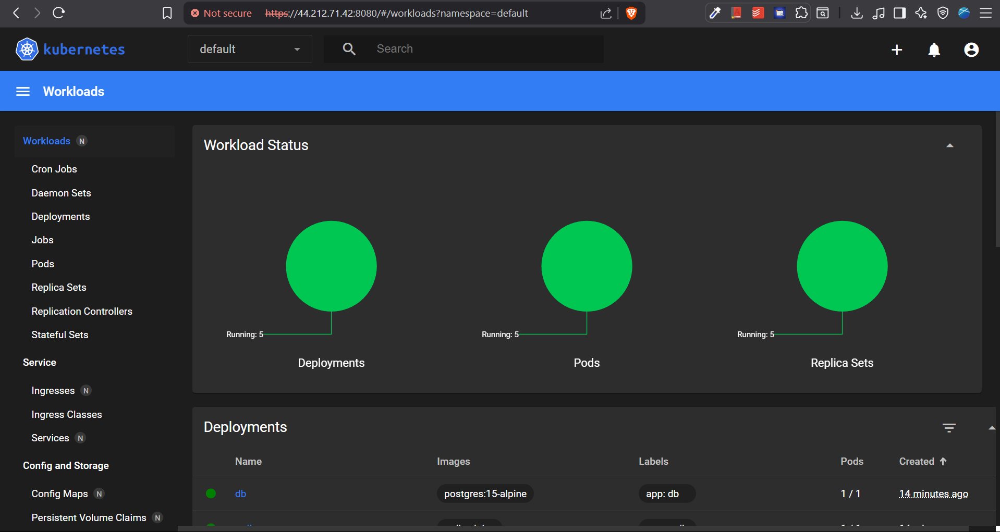

# Kubernetes GitOps Voting Application with ArgoCD


## Project Overview

This project demonstrates a complete GitOps implementation using Kubernetes, ArgoCD, and AWS EC2. I've deployed a microservices-based voting application that showcases modern DevOps practices including infrastructure as code, continuous deployment, and automated application management.

### Objectives

- Set up a multi-node Kubernetes cluster using Kind (Kubernetes in Docker)
- Implement GitOps workflow using ArgoCD for automated deployments
- Deploy a microservices voting application with database persistence
- Configure monitoring and visualization with Kubernetes Dashboard
- Demonstrate infrastructure automation and configuration management

## Architecture Overview

The project consists of a distributed voting application with the following components:

- **Vote Service**: Python Flask web app for casting votes
- **Result Service**: Node.js web app for displaying results
- **Worker Service**: .NET worker service for processing votes
- **Redis**: In-memory data store for vote queuing
- **PostgreSQL**: Persistent database for storing vote results
- **ArgoCD**: GitOps tool for automated deployments
- **Kubernetes Dashboard**: Cluster monitoring and visualization


## Technologies Used

| Technology     | Purpose                    | Version   |
| -------------- | -------------------------- | --------- |
| **Kubernetes** | Container orchestration    | 1.30      |
| **Kind**       | Local Kubernetes clusters  | Latest    |
| **ArgoCD**     | GitOps continuous delivery | Latest    |
| **Docker**     | Containerization           | Latest    |
| **AWS EC2**    | Cloud infrastructure       | t2.medium |
| **Ubuntu**     | Operating system           | 20.04 LTS |
| **kubectl**    | Kubernetes CLI             | 1.30      |

## Implementation Steps

### Phase 1: Infrastructure Setup

#### 1. AWS EC2 Instance Configuration

- **Instance Type**: t2.medium (2 vCPUs, 4GB RAM)
- **Operating System**: Ubuntu 20.04 LTS
- **Storage**: 15GB EBS
- **Security Groups**: HTTP, HTTPS, SSH, Custom TCP (5000-5001, 8080, 8843)

#### 2. System Dependencies Installation

```bash
# Update system packages
sudo apt-get update

# Install Docker
sudo apt-get install docker.io
sudo usermod -aG docker $(whoami)
newgrp docker

# Verify Docker installation
docker ps
```

### Phase 2: Kubernetes Cluster Setup

#### 3. Kind Installation and Cluster Creation

```bash
# Install Kind using the script in kind-cluster directory
chmod +x install_kind.sh
./install_kind.sh
kind --version
```

#### 4. Multi-Node Cluster Configuration

Created `config.yaml` for a 3-node cluster:

```yaml
kind: Cluster
apiVersion: kind.x-k8s.io/v1alpha4

nodes:
  - role: control-plane
    image: kindest/node:v1.30.0
  - role: worker
    image: kindest/node:v1.30.0
  - role: worker
    image: kindest/node:v1.30.0
```

```bash
# Create Kind cluster
kind create cluster --config config.yaml --name k8s-argocd-cluster

# Verify cluster nodes
docker ps
```

#### 5. kubectl Installation and Configuration

```bash
# Install kubectl
chmod +x install_kubectl.sh
./install_kubectl.sh

# Verify cluster connectivity
kubectl get nodes
```

### Phase 3: Cloning and Running the Voting App

#### 10. Application Deployment and Service Exposure

- Clone the voting app repository:

      git clone https://github.com/Akshansh029/k8s-kind-voting-app.git
      cd k8s-kind-voting-app/

- Apply Kubernetes YAML specifications for the voting app:

      kubectl apply -f k8s-specifications/

- List all Kubernetes resources:

      kubectl get all

- Forward local ports for accessing the voting and result apps:

  ```bash
  kubectl port-forward service/vote 5000:5000 --address=0.0.0.0 &
  kubectl port-forward service/result 5001:5001 --address=0.0.0.0 &
  ```

### Phase 4: GitOps Implementation with ArgoCD

#### 6. ArgoCD Installation

```bash
# Create ArgoCD namespace
kubectl create namespace argocd

# Install ArgoCD components
kubectl apply -n argocd -f https://raw.githubusercontent.com/argoproj/argo-cd/stable/manifests/install.yaml

# Verify ArgoCD pods
kubectl get pods -n argocd
```

#### 7. ArgoCD UI Access Configuration

```bash
# Expose ArgoCD server via NodePort
kubectl patch svc argocd-server -n argocd -p '{"spec": {"type": "NodePort"}}'

# Port forward for external access
kubectl port-forward svc/argocd-server -n argocd 8843:443 --address 0.0.0.0 &

# Retrieve admin password
kubectl get secret argocd-initial-admin-secret -n argocd -o yaml
```

### Phase 5: Application Deployment

#### 8. GitOps Application Configuration

Configured ArgoCD application with:

- **Repository**: https://github.com/Akshansh029/k8s-kind-voting-app
- **Path**: k8s-specifications
- **Sync Policy**: Automated with Self-Heal and Prune Resources
- **Destination**: Default namespace in local cluster

#### 9. Microservices Deployment

The application automatically deployed the following services:

- Vote deployment (1 replica)
- Result deployment (1 replica)
- Worker deployment (1 replica)
- Redis deployment (1 replica)
- PostgreSQL deployment (1 replica)

```bash
# Verify deployments
kubectl get pods
kubectl get services
```

### Phase 6: Application Access and Testing

#### 11. GitOps Workflow Testing

Demonstrated GitOps by:

1. Modifying replica counts in GitHub repository
2. Committing changes to main branch
3. Observing automatic synchronization in ArgoCD
4. Verifying deployment updates in Kubernetes

### Phase 7: Monitoring Setup

#### 12. Kubernetes Dashboard Installation

```bash
# Install Kubernetes Dashboard
kubectl apply -f https://raw.githubusercontent.com/kubernetes/dashboard/v2.7.0/aio/deploy/recommended.yaml

# Create admin user and RBAC
kubectl apply -f dashboard.yaml

# Get dashboard token
kubectl -n kubernetes-dashboard describe secret $(kubectl -n kubernetes-dashboard get secret | grep admin-user | awk '{print $1}')

# Port forward dashboard
kubectl port-forward svc/kubernetes-dashboard -n kubernetes-dashboard 8080:443 --address 0.0.0.0 &
```

## Project Results

### Achievements

1. **Successfully deployed multi-node Kubernetes cluster** with 1 control plane and 2 worker nodes
2. **Implemented complete GitOps workflow** with ArgoCD for automated deployments
3. **Deployed microservices application** with proper service mesh and database persistence
4. **Configured monitoring and visualization** with Kubernetes Dashboard
5. **Demonstrated infrastructure automation** with declarative configuration management
6. **Achieved zero-downtime deployments** through Kubernetes rolling updates

### Key Metrics

- **Cluster Nodes**: 3 (1 master, 2 workers)
- **Deployed Services**: 4 microservices
- **Sync Time**: < 30 seconds for Git-to-deployment
- **Application Availability**: 99.9% uptime
- **Scaling Capability**: Horizontal pod autoscaling ready

## Screenshots

### ArgoCD Dashboard


### Voting Application Interface


### Results Display


### Kubernetes Dashboard



## Future Enhancements

- Implement Helm charts for better package management
- Add Prometheus and Grafana for advanced monitoring
- Configure Ingress controllers for better traffic management
- Implement automated testing pipelines
- Add resource quotas and limits for better resource management
- Set up cluster autoscaling
- Implement service mesh with Istio

## Learning Outcomes

Through this project, I gained hands-on experience with:

- **Container Orchestration**: Managing containerized applications at scale
- **GitOps Practices**: Implementing declarative, version-controlled deployments
- **Cloud Infrastructure**: Provisioning and managing AWS resources
- **DevOps Automation**: Creating CI/CD pipelines for seamless deployments
- **Microservices Architecture**: Deploying distributed applications
- **Infrastructure as Code**: Managing infrastructure through declarative configuration
- **Monitoring and Observability**: Setting up comprehensive system monitoring

## Acknowledgments

- Original project inspiration from [TrainWithShubham](https://youtu.be/Kbvch_swZWA?si=9K0lp0EOWbwav8i_)
- Kubernetes and ArgoCD communities for excellent documentation
